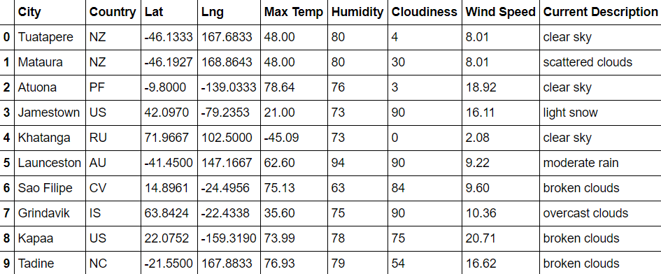
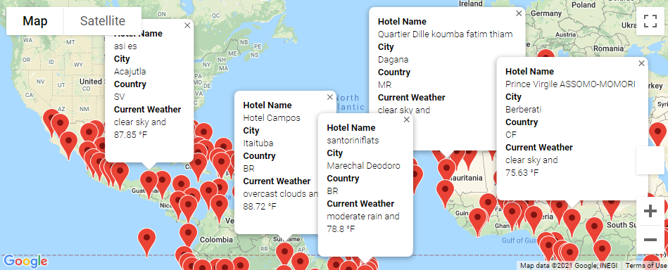
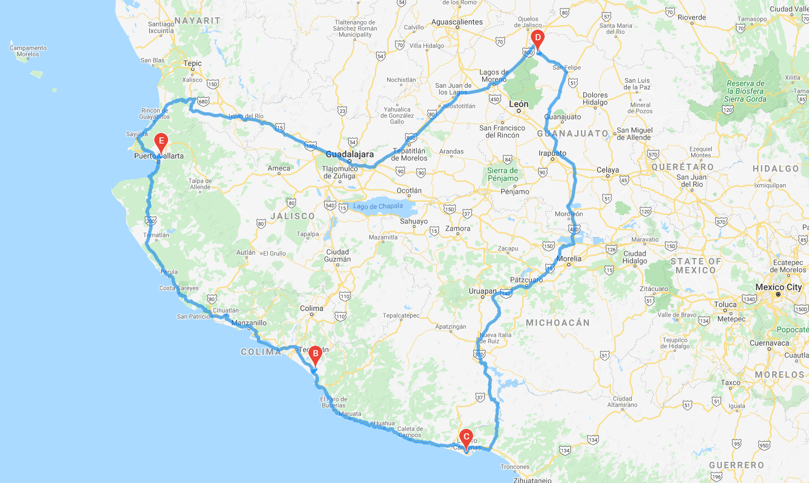
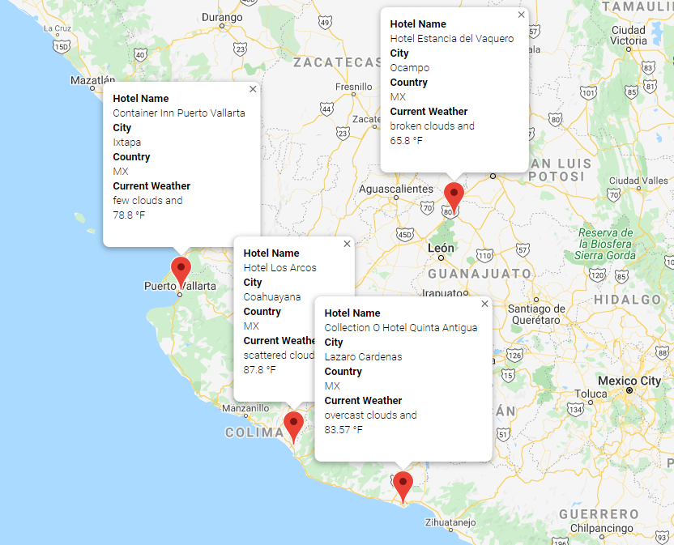

# World Weather Analysis 

# Update the PlanMyTrip app with the following: 

## 1) Deliverable #1 - Retrieve Additional Weather Data

  - We generated a set of 2,000 random latitudes and longitudes, retrieved the nearest city, and performed an API call with the OpenWeatherMap. In addition to the city weather data we previously gathered, we also retrieved the current weather description for each city. Finally, we created a new DataFrame containing the updated weather data.
  
  - Results
  
      
  
  - Files
  
      [Weather_Database.ipynb](Weather_Database/Weather_Database.ipynb)
      
      [WeatherPy_Database.csv](Weather_Database/WeatherPy_Database.csv)
  
  
## 2) Deliverable #2 - Create a Customer Travel Destinations Map

  - We used input statements to retrieve customer weather preferences and then used those preferences to identify potential travel destinations and nearby hotels. Then we displayed those destinations on a marker layer map with pop-up markers.
  
    - Results
  
      
  
  - Files
  
      [Vacation_Search.ipynb](Vacation_Search/Vacation_Search.ipynb)
      
      [WeatherPy_vacation.csv](Vacation_Search/WeatherPy_vacation.csv)

  
## 3) Deliverable #3 - Create a Travel Itinerary Map

  - We used the Google Directions API to create a travel itinerary that shows the route between the four cities chosen from the customer’s possible travel destinations. Then we created a marker layer map with a pop-up marker for each city on the itinerary.
  
    - Results
  
      
      
      
  
  - Files
  
      [Vacation_Itinerary.ipynb](Vacation_Itinerary/Vacation_Itinerary.ipynb)
  
## APIs Used
- OpenWeather API
- Google Maps Places API
- Google Maps Directions API
